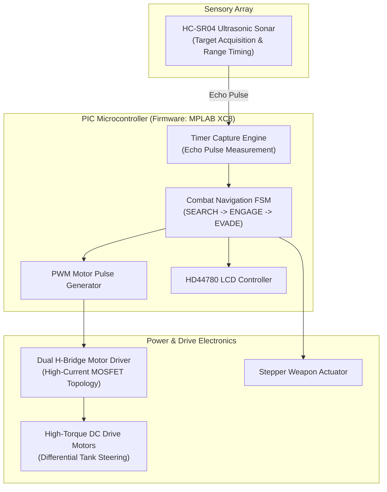

# Autonomous Combat Robotics Platform & H-Bridge Motor Controller

[](https://www.harry-rogers.com)
[-success?style=for-the-badge)](https://www.harry-rogers.com)
[](https://www.microchip.com)
[](https://www.labcenter.com)

> Hardware schematics, PCB layouts, and embedded C firmware for the **University of Brighton Robot Wars Competition**, achieving a **2nd Place Overall Podium Finish** in the inter-collegiate arena combat tournament. Combines dual high-current DC motor H-bridge drivers, ultrasonic obstacle tracking, stepper actuation, and an onboard HD44780 status display.

---

### 📜 Academic Integrity & Attribution Disclosure
- **Team Project Context & Individual Contributions:** Developed as part of the collegiate Robot Wars competition team during undergraduate engineering studies. Harry Rogers served as lead systems and firmware engineer, authoring the embedded C motor driver routines, ultrasonic sonar capture interrupts, and Proteus simulation schematics.
- **Distinct Project Scope:** This combat platform was engineered specifically for the Robot Wars arena tournament, distinct from the autonomous corridor-navigating sensor buggy and separate from the low-level MPASM assembly library.
- **Third-Party & Vendor IP:** Compiler runtime and device peripheral registers are copyright **Microchip Technology Inc.** Simulation models and EDA schematic libraries utilize standard components from **Labcenter Electronics Proteus Design Suite**.

---

## 🏆 Key Achievements

- **2nd Place Podium Finish** in the University of Brighton Robot Wars Tournament.
- **82% Distinction Grade (A+)** in XE521 Engineering Design.
- **Dual Motor Differential Drive:** High-torque H-bridge motor driver schematic designed and verified in **Labcenter Proteus Design Suite** (`schematics_proteus/`).
- **Real-Time Sonar Ranging:** Ultrasonic sensor (HC-SR04) echo capture routines executed via hardware timer interrupts for target detection and wall evasion.
- **Embedded C Firmware:** Modular XC8 C architecture for pulse width modulation, differential steering, and auxiliary weapon actuation.

---

## 🏗️ Hardware Architecture



---

## 📂 Repository Contents

```
robot-wars-combat-platform/
├── schematics_proteus/
│   ├── Motor Controller.pdsprj     # Primary Proteus PCB schematic & simulation
│   ├── MotorController.pdsprj      # H-bridge MOSFET driver board design
│   └── MotorController1.pdsprj     # Power distribution & filtering layout
└── firmware_xc8/
    ├── drive_controller/
    │   ├── MovementCode.c          # Dual-wheel differential drive & speed control
    │   └── lcd.c                   # HD44780 character LCD diagnostic interface
    ├── ultrasonic_sonar/
    │   └── ultrasonic_driver.c     # Precision timer-based HC-SR04 sonar driver
    └── stepper_weapon/
        └── newmain.c               # Actuator step-sequencing and weapon trigger
```

---

## 🛠️ Build & Simulation Guide

### Circuit Simulation in Proteus
1. Open **Labcenter Proteus 8 Professional**.
2. Load `schematics_proteus/Motor Controller.pdsprj`.
3. Press **Play** in the VSM simulation panel to test logic levels, gate drive waveforms, and motor direction controls.

### Firmware Compilation in MPLAB X
1. Open **Microchip MPLAB X IDE**.
2. Open the project targeting the PIC microcontroller.
3. Select **XC8** C compiler.
4. Build the solution and flash via PICkit or simulate in Proteus with the generated `.hex` artifact.

---

## 🎓 Academic Attribution

- **Author:** Harry Rogers
- **Degree:** BEng (Hons) Electronic & Computer Engineering (First-Class Honours)
- **Institution:** University of Brighton
- **Module:** XE521 - Engineering Design & EO524 - Embedded Systems
- **Distinction:** Robot Wars 2nd Place Prize
- **Portfolio:** [www.harry-rogers.com](https://www.harry-rogers.com)

---

## 📄 License
This repository is licensed under the MIT License.
